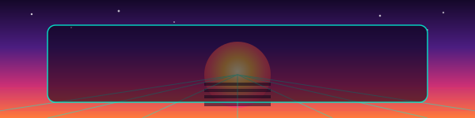

<h2 align="left">Hey, I'm Amaey Agarwal 👋</h2>
<h4 align="left">Computer Science student · Co-founder @ Wilexier Techno LLP · Building in agentic AI & F1 telemetry systems</h4>

###

  
  

###

### 🚀 What I'm building

**S.C.I.T.T.E.S.** (Strategy Command Integrated Telemetry Tactical Simulation Environment) — a real-time F1 telemetry dashboard with live race data streaming and a predictive strategy layer.
`FastAPI` `Redis Pub/Sub` `React` `WebSocket` `XGBoost`
🔗 [ADD REPO LINK]

**Multi-Agent Council** — a LangChain-based multi-agent orchestration system for coordinating specialized agents on complex reasoning tasks. Accompanying research paper accepted at an IEEE conference and a Springer LNCS volume.
`LangChain` `Python` `Multi-Agent Orchestration`
🔗 [ADD REPO LINK]

**Aquatox** — marketing site for a USV (unmanned surface vehicle) concept for aquatic debris collection and water quality monitoring, built under Wilexier Techno LLP.
`Next.js` `Tailwind CSS` `Zustand` `React Three Fiber`
🔗 [ADD REPO LINK]

**E-commerce websites** — multiple client sites built and launched end-to-end.
`Shopify` `Wix` `HTML` `CSS` `JavaScript`
🔗 [ADD LIVE SITE / REPO LINK — repo coming soon]

###

### 🛠️ Stack

  
  
  
  
  
  
  
  
  
  
  
  
  
  
  
  
  
  
  
  
  

###

### 📫 Connect

  
  
  

###

  

